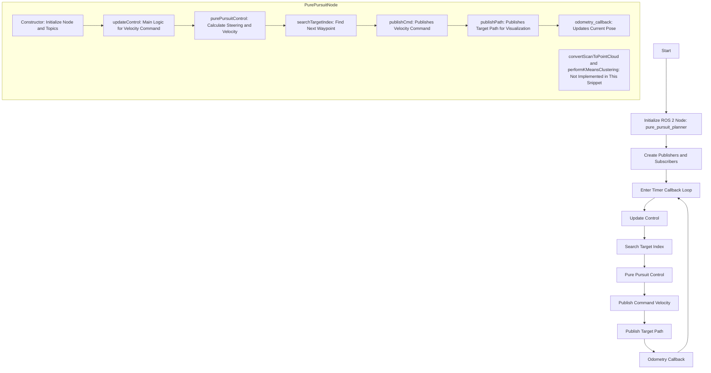

## Functional Overview
This software implements a ROS 2 node for path following control of robots or autonomous vehicles using the Pure Pursuit algorithm. It calculates and outputs velocity and angular velocity commands to efficiently navigate the robot along a specified path.

## Interface Table

### Input

| Variable Name      | Type            | Description                         |
|-------------------------|-------------------|---------------------------------------|
| `odom`                  | `nav_msgs::msg::Odometry` | Odometry information of the robot |

### Output

| Variable Name      | Type            | Description                         |
|-------------------------|-------------------|---------------------------------------|
| `cmd_vel`               | `geometry_msgs::msg::Twist` | Velocity and angular velocity commands for the robot |
| `target_path`           | `nav_msgs::msg::Path` | Path to follow |

### Internal Values

| Variable Name      | Type            | Description                         |
|-------------------------|-------------------|---------------------------------------|
| `x`, `y`, `yaw`         | `double`          | Current position and orientation of the robot |
| `v`, `w`                | `double`          | Velocity and angular velocity of the robot |
| `cx`, `cy`              | `std::vector<double>` | List of x and y coordinates of the path |
| `target_ind`            | `int`             | Current target index |
| `target_vel`            | `double`          | Target velocity |
| `goal_threshold`        | `double`          | Threshold for goal judgment |
| `k`, `Lfc`, `Kp`, `dt`  | `double`          | Pure Pursuit parameters |
| `oldNearestPointIndex`  | `int`             | Index of the nearest point in the previous iteration |
| `current_vel`           | `double`          | Current velocity of the robot |

## システム構成図 (System Configuration Diagram)

## 機能要件 (Functional Requirements)

| 機能 (Feature)                    | 要件 (Requirement)                                     | 理由 (Reason)                                             | 仕様 (Specification)                                                                                                                                                                 | 実関数 (Implemented Functions)                          |
|---------------------------------|------------------------------------------------------|---------------------------------------------------------|------------------------------------------------------------------------------------------------------------------------------------------------------------------------------------|------------------------------------------------------|
| **パス追従制御 (Path Following Control)** | ロボットは指定された経路に沿って効率的に移動すること。 (The robot needs to efficiently move along the specified path.) | ロボットが目標に向かって正確に進むため。 (To ensure the robot accurately progresses towards the target.) | - Pure Pursuitアルゴリズムを使用して、ロボットの現在位置から見たターゲットポイントへの角度を計算し、それに基づいて速度と角速度を決定する。 (Implemented in `purePursuitControl`) - 経路上でロボットから一定距離 (`Lf`) 先にあるターゲットポイントのインデックスを探索する。距離は速度に応じて動的に変化する。 (Implemented in `searchTargetIndex`) | `updateControl`, `purePursuitControl`, `searchTargetIndex` |
| **速度指令出力 (Velocity Command Output)** | ロボットは計算された速度と角速度の指令を出力すること。 (The robot needs to output the computed velocity and angular velocity commands.) | ロボットが適切な速度で進むため。 (To ensure the robot progresses at the appropriate speed.) | - 計算された速度 (`v`) と角速度 (`w`) を`geometry_msgs::msg::Twist`メッセージとして出力する。 (Implemented in `publishCmd`) - ゴールに近づいた場合 (`goal_threshold` 未満) は速度と角速度をゼロにして停止する。 (Implemented in `publishCmd`) | `publishCmd`                                   |
| **経路出力 (Path Output)**              | ロボットは追従する経路を出力すること。 (The robot needs to output the path to follow.)               | ナビゲーションのための参照経路を提供するため。 (To provide a reference path for navigation.) | - 経路の各ポイント (`cx[i]`, `cy[i]`) を`nav_msgs::msg::Path`メッセージの一部として出力する。各ポイントは`geometry_msgs::msg::PoseStamped`メッセージとして格納される。 (Implemented in `publishPath`) | `publishPath`                                  |
| **オドメトリ受信 (Odometry Reception)**  | ロボットはオドメトリ情報を受信すること。 (The robot needs to receive odometry information.)         | ロボットの現在位置と向きを更新するため。 (To update the current position and orientation of the robot.) | - 受信した`nav_msgs::msg::Odometry`メッセージからロボットの現在位置 (`x`, `y`) と向き (`yaw`) を抽出し、内部変数を更新する。 (Implemented in `odometry_callback`) | `odometry_callback`                           |

## 詳細設計 (Detailed Design)

| メソッド名 (Method Name) | 目的 (Purpose)                           | 処理内容 (Process)                                                                                                          |
|-----------------------|----------------------------------------|---------------------------------------------------------------------------------------------------------------------------|
| `updateControl`       | 制御ループを実行し、速度指令と追従経路を更新する。    | 1. `purePursuitControl`メソッドを呼び出して速度と角速度を計算する。 2. `publishCmd`メソッドを呼び出して速度指令をパブリッシュする。 3. `publishPath`メソッドを呼び出して追従経路をパブリッシュする。 |
| `purePursuitControl`  | Pure Pursuitアルゴリズムに基づいて速度と角速度を計算する。 | 1. `searchTargetIndex`メソッドを呼び出してターゲットポイントのインデックスを探索する。 2. ターゲットポイントに対する角度を計算する。 3. 計算された角度とパラメータに基づいて速度と角速度を計算する。 |
| `publishPath`         | 追従経路をパブリッシュする。                   | 1. `nav_msgs::msg::Path`メッセージを作成する。 2. 経路の各ポイントを`Path`メッセージに追加する。 3. `path_pub`を使用して`Path`メッセージをパブリッシュする。 |
| `searchTargetIndex`   | ターゲットポイントのインデックスを探索する。             | 1. ロボットから一定距離 (`Lf`) 先にあるターゲットポイントのインデックスを探索する。 2. 距離は速度に応じて動的に変化する。 |
| `calcDistance`        | 点とロボットの現在位置との距離を計算する。             | 1. ロボットの現在位置 (`x`, `y`) と指定された点 (`point_x`, `point_y`) とのユークリッド距離を計算する。 |
| `odometry_callback`   | オドメトリ情報のコールバック関数。                | 1. 受信した`nav_msgs::msg::Odometry`メッセージからロボットの現在位置 (`x`, `y`) と向き (`yaw`) を抽出し、内部変数を更新する。 |
| `publishCmd`          | 速度指令をパブリッシュする。                     | 1. `geometry_msgs::msg::Twist`メッセージを作成し、計算された速度 (`v`) と角速度 (`w`) を設定する。 2. `cmd_vel_pub`を使用して`Twist`メッセージをパブリッシュする。 3. ゴールに近づいた場合 (`goal_threshold` 未満) は速度と角速度をゼロにして停止する。 |
