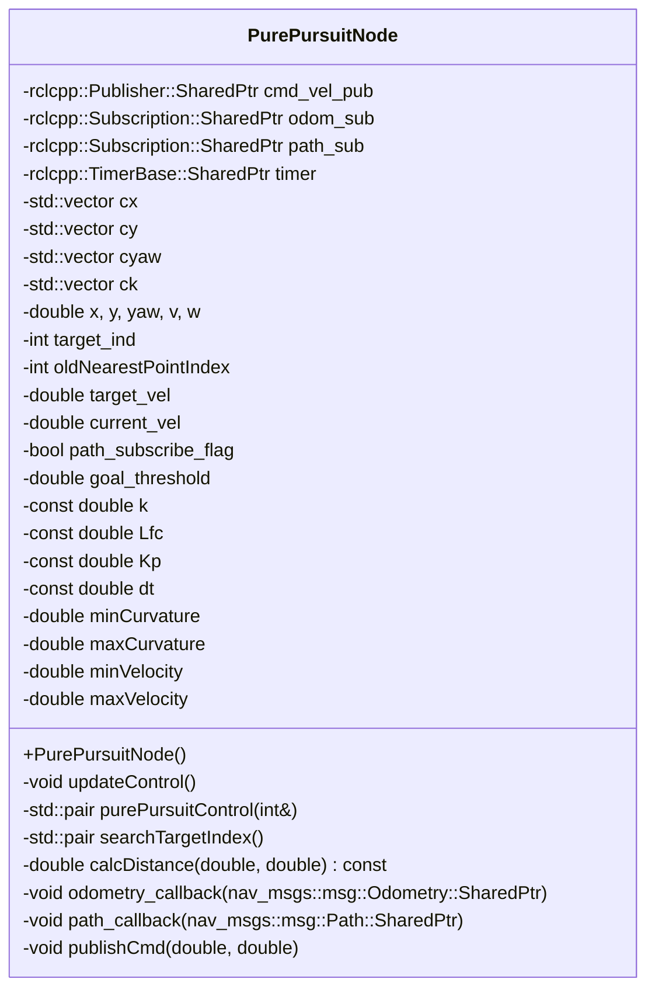
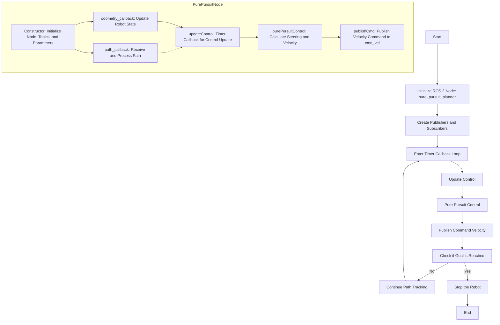
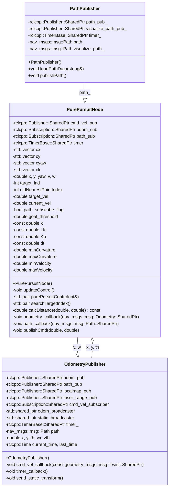

<p style="display: inline">
  <!-- Programming Language -->
  
  <!-- ROS 2 -->
  
  <!-- Geometry Messages -->
  
  <!-- Navigation Messages -->
  
  <!-- TF2 -->
  
</p>

## Functional Overview
This software implements a ROS 2 node for path following control of robots or autonomous vehicles using the Pure Pursuit algorithm. It calculates and outputs velocity and angular velocity commands to efficiently navigate the robot along a specified path.


## Requirements
### System Requirements
- OS : Ubuntu 22.04  
- ROS2 : Humble

### System Dependencies
- [path_smoother](https://github.com/Arcanain/path_smoother) 
- [arcanain_simulator](https://github.com/Arcanain/arcanain_simulator) 

## How To Use
### Execution Steps
```bash
cd ~/ros2_ws
source ~/ros2_ws/install/setup.bash
ros2 launch pure_pursuit_planner pure_pursuit_planner.py
```

### Folder Structure
```
pure_pursuit_planner/
├── include/                               - Directory for header files
│   └── pure_pursuit_planner/              - Header files for the pure_pursuit_planner package
│       └── pure_pursuit_planner_component.hpp - Header file for the Pure Pursuit planner component
├── launch/                                - Directory for ROS 2 launch files
│   └── pure_pursuit_planner.py            - Launch script for the pure_pursuit_planner node
├── rviz/                                  - Directory for RViz configuration files
│   └── pure_pursuit_planner.rviz          - RViz configuration file for the Pure Pursuit planner
├── src/                                   - Directory for source files
│   ├── pure_pursuit_planner_component.cpp - Implementation of the Pure Pursuit planner component
│   └── pure_pursuit_planner_node.cpp      - Node implementation for the Pure Pursuit planner
├── CMakeLists.txt                         - CMake build configuration file
└── package.xml                            - ROS 2 package metadata file
```

## Interface Table

### Input

| Variable Name      | Type            | Description                         |
|-------------------------|-------------------|---------------------------------------|
| `odom`                  | `nav_msgs::msg::Odometry` | Odometry information of the robot |
| `tgt_path`              | `nav_msgs::msg::Path` | Target trajectory of the robot |

### Output

| Variable Name      | Type            | Description                         |
|-------------------------|-------------------|---------------------------------------|
| `cmd_vel`               | `geometry_msgs::msg::Twist` | Velocity and angular velocity commands for the robot |

### Internal Values

| Variable Name      | Type            | Description                         |
|-------------------------|-------------------|---------------------------------------|
| `x`, `y`, `yaw`         | `double`          | Current position and orientation of the robot |
| `v`, `w`                | `double`          | Velocity and angular velocity of the robot |
| `cx`, `cy`,`cyaw`, `ck` | `std::vector<double>` | List of x and y coordinates of the path |
| `target_ind`            | `int`             | Current target index |
| `target_vel`            | `double`          | Target velocity |
| `goal_threshold`        | `double`          | Threshold for goal judgment |
| `k`, `Lfc`, `Kp`, `dt`  | `double`          | Pure Pursuit parameters |
| `oldNearestPointIndex`  | `int`             | Index of the nearest point in the previous iteration |
| `current_vel`           | `double`          | Current velocity of the robot |
| `minCurvature`,`maxCurvature`         | `double`          | Minimum and maximum curvature values |
| `minVelocity`,`maxVelocity`           | `double`          | Minimum and maximum velocity values |

## Software architecture

### Class Diagram



### Flowchart



## System architecture



## Functional Requirements

| Feature                    | Requirement                                            | Reason                                                      | Specification                                                                                                                                                                | Implemented Functions                          |
|----------------------------|--------------------------------------------------------|-------------------------------------------------------------|------------------------------------------------------------------------------------------------------------------------------------------------------------------------------|----------------------------------------------|
| **Path Following Control** | The robot needs to efficiently move along the specified path. | To ensure the robot accurately progresses towards the target. | - Use the Pure Pursuit algorithm to calculate the angle to the target point from the robot's current position and determine the velocity and angular velocity based on that.<br>(Implemented in `purePursuitControl`)<br>- Search for the index of the target point on the path that is a certain distance (`Lf`) ahead of the robot. The distance dynamically changes according to the velocity.<br>(Implemented in `searchTargetIndex`) | `updateControl`, `purePursuitControl`, `searchTargetIndex` |
| **Velocity Command Output** | The robot needs to output the computed velocity and angular velocity commands. | To ensure the robot progresses at the appropriate speed. | - Output the computed velocity (`v`) and angular velocity (`w`) as a `geometry_msgs::msg::Twist` message.<br>(Implemented in `publishCmd`)<br>- Stop by setting the velocity and angular velocity to zero if approaching the goal (`goal_threshold` or less).<br>(Implemented in `publishCmd`) | `publishCmd`                                   |
| **Path Output**             | The robot needs to output the path to follow.             | To provide a reference path for navigation.                 | - Output each point of the path (`cx[i]`, `cy[i]`) as part of a `nav_msgs::msg::Path` message. Each point is stored as a `geometry_msgs::msg::PoseStamped` message.<br>(Implemented in `publishPath`) | `publishPath`                                  |
| **Odometry Reception**      | The robot needs to receive odometry information.          | To update the current position and orientation of the robot. | - Extract the robot's current position (`x`, `y`) and orientation (`yaw`) from the received `nav_msgs::msg::Odometry` message and update the internal variables.<br>(Implemented in `odometry_callback`) | `odometry_callback`                           |

## Detailed Design

| Method Name           | Purpose                                           | Process                                                                                                                                    |
|-----------------------|---------------------------------------------------|---------------------------------------------------------------------------------------------------------------------------------------------|
| `updateControl`       | To execute the control loop and update the velocity command and following path. | 1. Call the `purePursuitControl` method to calculate the velocity and angular velocity.<br>2. Call the `publishCmd` method to publish the velocity command.<br>3. Call the `publishPath` method to publish the following path. |
| `purePursuitControl`  | To calculate the velocity and angular velocity based on the Pure Pursuit algorithm. | 1. Call the `searchTargetIndex` method to search for the index of the target point.<br>2. Calculate the angle to the target point.<br>3. Calculate the velocity and angular velocity based on the calculated angle and parameters. |
| `publishPath`         | To publish the following path.                        | 1. Create a `nav_msgs::msg::Path` message.<br>2. Add each point of the path to the `Path` message.<br>3. Use `path_pub` to publish the `Path` message. |
| `searchTargetIndex`   | To search for the index of the target point.         | 1. Search for the index of the target point that is a certain distance (`Lf`) ahead of the robot.<br>2. The distance dynamically changes according to the velocity. |
| `calcDistance`        | To calculate the distance between a point and the robot's current position. | 1. Calculate the Euclidean distance between the robot's current position (`x`, `y`) and the specified point (`point_x`, `point_y`). |
| `odometry_callback`   | Callback function for odometry information.          | 1. Extract the robot's current position (`x`, `y`) and orientation (`yaw`) from the received `nav_msgs::msg::Odometry` message and update the internal variables. |
| `publishCmd`          | To publish the velocity command.                     | 1. Create a `geometry_msgs::msg::Twist` message and set the calculated velocity (`v`) and angular velocity (`w`).<br>2. Use `cmd_vel_pub` to publish the `Twist` message.<br>3. Stop by setting the velocity and angular velocity to zero if approaching the goal (`goal_threshold` or less). |
